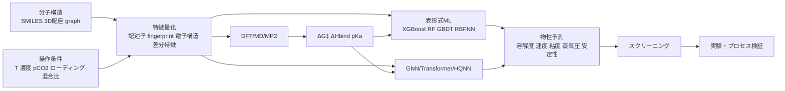

# アミンの分子構造から物性を予測するモデル

## エグゼクティブサマリ

アミンの分子構造から物性を予測する研究は、2022年以降に大きく三つの流れへ分化しました。第一は、分子記述子・フィンガープリント・操作条件を入力する表形式の機械学習で、主対象は CO₂ 平衡溶解度、吸収容量、粘度、蒸気圧などです。第二は、DFT・MP2・分子動力学を使って、反応障壁、CO₂ 結合エンタルピー、pKₐ といったより機構寄りの物性を直接計算する第一原理系です。第三は、これらを組み合わせたハイブリッド手法で、MD/DFT で教師ラベルを作り、その上に XGBoost・RF・GNN・生成モデルを載せて大規模スクリーニングや逆設計へ拡張する流れです。現在の主戦場はなお「低分子アミン × CO₂ 吸収平衡／速度」であり、高分子アミンや固体担持アミンは、DAC 材料設計や PEI 系ベンチマークに限って研究が伸び始めています。 citeturn42search12turn41view0turn6view9turn13search3turn12search25turn35search0turn24search1

いま最も実務的に強いのは、**構造特徴＋条件変数**を一緒に扱う勾配ブースティング系です。2024年の aqueous amine 溶解度研究では、学習済みモデルで R²=0.971、独立実験に対する AAD=4.785% が報告され、SHAP による特徴寄与解析も行われました。2025年の interpretable model では 57 系・2396 点を用いた GBDT が、訓練 R²=0.9645、検証 R²=0.9481、未知アミン外部評価でも R²=0.8601 を示しました。さらに blended amine を対象にした 2025 年の structural encoding 研究では、BSE-XGBoost が R²=0.984、MSE=0.001 を達成しています。つまり「系統が似たアミン群・条件付き回帰」であれば、XGBoost/GBDT 系は非常に強いです。 citeturn11search4turn28search3turn26search1turn26search5turn27search0

ただし、**新しい化学空間へ外挿したいとき**は、物理ベースのラベル生成や機構拘束が重要になります。2022年の *Communications Chemistry* 論文は、24 種の実験速度データを足場に MD ベース速度・自由エネルギー予測を構築し、100 種の第三級アミンへ拡張したうえで、QSPR と組み合わせて 800 超のアミンを仮想スクリーニングしました。2024年の DAC 材料設計 preprint は、15,336個の窒素含有分子に対する DFT 結合エンタルピーを学習し、2D 記述子モデルで R²=0.79、RMSE=0.13 eV、3D 差分記述子では R²=0.87、RMSE=0.10 eV を示しました。2025年の diamine/tertiary-amine 混合設計研究では、DFT 障壁計算と active learning を組み合わせ、律速段階障壁に対して R²=0.821 を得て、AEEA + EDMA を有望候補として同定しています。 citeturn17view3turn41view0turn35search3

GNN・Transformer・量子機械学習は、2025年から明確に登場し始めましたが、**ベンチマークの厚みはまだ木系モデルに劣ります**。2025–2026年には、descriptor-free GNN、graph convolutional fusion、physics-informed GNN が amine 溶解度予測へ投入され、PIGNN は公開コードと環境まで提供されています。一方、Transformer は現状では直接回帰よりも、SAGE-Amine のような**生成・逆設計**で使われるケースが中心です。HQNN も basicity、viscosity、boiling point、melting point、vapor pressure を対象とする有望な方向ですが、現段階では early-stage の学術実証です。 citeturn30search3turn30search4turn30search14turn32view0turn32view1turn13search0turn13search3

研究ギャップは明確です。公開データは「水系・低分子・平衡溶解度」に偏り、**再生エネルギー、腐食性、長期熱酸化安定性、高分子アミンのサイクル劣化**に関する構造ベース予測はまだ薄いです。また、多くの論文がランダム分割を用い、**未知骨格外挿**や**スキャフォールド分割**を十分に試していません。したがって、2026年時点の最善戦略は、①低分子アミンでは XGBoost/GBDT を主軸に、②新規化学や材料化へ進む段階で DFT/MD/active learning/GNN を追加し、③最終判断は必ず外部検証・実験・プロセス評価へ接続する、という三段構えです。 citeturn34search3turn17view0turn18view3turn26search1turn41view0

## 方法論と対象範囲

本レポートの対象は、**2022年1月以降**に公開された、アミンの分子構造から物性を予測する研究です。査読論文を主対象とし、補助的に arXiv・ChemRxiv・SSRN・会議論文メタデータも含めました。優先した情報源は、出版社公式ページ、DOI ランディングページ、PubMed、arXiv、ChemRxiv、研究機関リポジトリ、公開コードリポジトリです。検索の中心は、CO₂ 溶解度、吸収速度、結合エンタルピー、pKₐ、粘度、蒸気圧、熱分解・酸化分解、DAC 材料設計、GNN/Transformer/active learning/quantum ML でした。 citeturn34search3turn42search12turn42search1turn13search0

文献の質には段差があります。2022–2024年の主要論文は本文・抄録・実装断片が比較的追跡しやすい一方、2025–2026年の一部論文は **DOI・抄録・二次メタデータのみ**が確認可能で、ハイパーパラメータや完全な外部検証条件までは取得できませんでした。そのため本レポートでは、アクセス可能な原著に基づく記述と、二次メタデータに基づく記述を明確に分け、後者には過剰な一般化を避けています。 citeturn26search1turn27search0turn30search3turn30search4turn24search1

対象分子は、未指定仮定に従って**一般的な低分子アミンと高分子アミンの両方**を含めました。ただし、実際に文献が厚いのは低分子の mono/di/tri-amine、alkanolamine、cyclic amine、blended amine です。高分子アミンは、branched polyethylenimine を基準点にした DAC 材料設計やアミン機能化分子の結合エンタルピー予測として現れますが、低分子系ほどの公開ベンチマークはまだありません。 citeturn41view0turn41view1turn6view9

## 考慮すべき属性と次元

アミンの「構造→物性」予測で重要なのは、**分子構造だけを見れば十分ではない**という点です。2022年の hybrid MD–QSPR 研究では、pKₐ は重要だが、速度予測の精度には溶媒和自由エネルギーの扱いが決定的だと示されました。2024–2025年の高性能な溶解度モデルも、分子特徴だけでなく温度、濃度、CO₂ 分圧、ローディング、混合比などの条件変数を明示的に入力しています。つまり、アミン予測は「分子機械学習」と「熱力学条件付き回帰」の中間にあります。 citeturn17view3turn11search4turn26search1turn27search0

| 次元 | 具体例 | 物性への効き方 | 現状の代表入力 |
|---|---|---|---|
| 骨格・官能基 | 一級/二級/三級、環状/鎖状、OH 置換、アミン数 | carbamate/bicarbonate 経路、塩基性、立体障害を左右 | SMILES、fingerprint、CCS fingerprint、graph |
| トポロジー | 鎖長、分岐、環サイズ、ヘテロ原子配置 | 粘度、拡散、溶媒和、分子間相互作用に影響 | Mordred、ISIDA、Morgan/MACCS、GCN |
| 電子的性質 | pKₐ、プロトン親和力、HOMO/LUMO、ESP、H-bond donor/acceptor | CO₂ 反応性、結合エンタルピー、蒸気圧・沸点の proxy | OPERA、QM 記述子、delta-learning、差分記述子 |
| 立体・3D | 最安定配座、N–O 距離、vdW 体積、SASA | 反応障壁、CO₂ 結合配置、差分 3D descriptor に効く | DFT 最適化構造、MP2/DFT、3D Mordred |
| 混合・プロセス条件 | T、P、pCO₂、濃度、ローディング、混合比、水分 | 溶解度・速度・再生エネルギーを強く支配 | tabular 変数として併用 |
| 材料文脈 | PEI 分岐度、担体極性、細孔径、湿度 | DAC での binding window、再生性、拡散 | 高スループット DFT、materials descriptors |
| 目的関数 | 溶解度、速度、吸収熱、粘度、蒸気圧、熱安定性、障壁 | 単目的最適化か多目的最適化かを決める | 単一回帰、分類、MPO スコア |

この整理は、2022年の MD–QSPR、2024年の CCS fingerprint 論文、2024年の blended amine generic model、2024年の DAC 高スループット ML、2025年の interpretable solubility model、2025年の structural encoding、2026年の pKₐ delta-learning 論文群を突き合わせて得られます。特に 2024 DAC 論文が示した**差分記述子**、2025 blended amine 論文が示した**構造エンコーディング**、2026 pKₐ 論文が示した**量子-informed 補正**は、いずれも「元の分子を丸ごと記述する」よりも「反応・混合・プロトン化で何が変わるか」を表現しようとしている点で共通です。 citeturn18view3turn19view4turn42search6turn41view0turn26search1turn27search0turn24search1

この流れ図は、2022年の hybrid screening、2024年の descriptor/classification、2024年 DAC 高スループット ML、2025年の GNN 群、2025年 SAGE-Amine、2025年 active learning 設計を統合したものです。重要なのは、実際の高性能モデルの多くが「graph だけ」「DFT だけ」ではなく、**構造・条件・物理量の多層統合**になっている点です。 citeturn17view3turn19view4turn41view0turn30search3turn32view0turn35search3

## 主要研究の比較表

以下の表は、2022年以降の代表研究を、**モデル系・入力・データ・性能・用途**の観点で並べたものです。査読論文を優先しつつ、2025–2026年の一部行には出版社抄録や公開メタデータに依拠したものを含みます。 citeturn37search0turn42search12turn6view2turn42search11turn42search6turn41view0turn11search4turn25search16turn27search0turn13search3turn12search25turn35search0turn24search1

| 論文名 | 年 | 著者 | モデル | 入力特徴 | データセット | 性能 | 用途 | 主要結論 | 出典 |
|---|---:|---|---|---|---|---|---|---|---|
| Novel Machine Learning Model Correlating CO₂ Equilibrium Solubility in Three Tertiary Amines | 2022 | Helei Liu ら | ANN, XGBoost | 新規第三級アミン系の実験条件・系情報 | 3つの新規 tertiary amine 系 | XGBoost の MAPE: 3.77%, 0.29%, 0.70% | CO₂ 平衡溶解度 | 小規模系でも XGBoost が ANN より安定 | 10.1021/acs.iecr.2c02006 |
| Computational Screening Methodology Identifies Effective Solvents for CO₂ Capture | 2022 | Alexey A. Orlov, Alain Valtz, Christophe Coquelet, Xavier Rozanska ら | MD + RF/XGBoost QSPR | pKₐ, OPERA 物性, ISIDA fragments | 24実験 + 100 tertiary amine MD ラベル + >800 virtual screening | ΔG 精度 <1 kJ/mol、Q²CV 閾値 R≥0.6, ΔG≥0.7 | CO₂ 吸収速度、自由エネルギー | 実験を置き換えるのではなく、実験候補の優先順位付けに強い | 10.1038/s42004-022-00654-y |
| Chemical Space Analysis and Property Prediction for Carbon Capture Solvent Molecules | 2024 | Jammy McDonagh ら | Logistic Regression, Gaussian Process, AdaBoost | Mordred, MACCS, CCS fingerprint | ccs-98 実験集合 | CCS-LR: Accuracy 0.84, Sensitivity 0.70, Specificity 0.89, MCC 0.59 | 高/低吸収容量の分類 | 専用 fingerprint が汎用 descriptor より解釈性とバランス性能で優位 | 10.1039/D3DD00073G |
| Feature Analysis of Generic AI Models for CO₂ Equilibrium Solubility into Amines Systems | 2024 | Ting Lan, Shoulong Dong, Hui Luo, Liju Bai, Helei Liu | BPNN, RBFNN, RF | 7–8個の選抜パラメータ | amine 系 CO₂ 平衡溶解度データ | 最良は RBFNN、8変数で AARE 1.52% | CO₂ 平衡溶解度 | 少数特徴でも高精度化可能、特徴選択が鍵 | 10.1002/aic.18363 |
| A Generic Machine Learning Model for CO₂ Equilibrium Solubility into Blended Amine Solutions | 2024 | Haonan Liu, Jiaqi Qu, Ali Hassan Bhatti, Francesco Barzagli ら | RBFNN, SVR, XGBoost | blended amine 系・条件変数 | MEA/DEEA/MDEA 系の blended amine データ | 抄録から比較優位は確認、詳細指標は本文依存 | blended amine 溶解度 | 混合アミンにも generic model を拡張可能 | 10.1016/j.seppur.2023.126100 |
| Design of Amine-Functionalized Materials for Direct Air Capture Using Integrated High-Throughput Calculations and Machine Learning | 2024 | Megan C. Davis, Wilton J. M. Kort-Kamp, Ivana Matanovic, Piotr Zelenay, Edward F. Holby | DFT + descriptor ML | 2D Mordred、差分 descriptors、3D differential descriptors | 15,336 DFT ラベル、1,650,601 binding sites screening | 2D: R² 0.79 / RMSE 0.13 eV、3D: R² 0.87 / RMSE 0.10 eV | CO₂ 結合エンタルピー、DAC 材料 | 大規模 DAC スクリーニングの成立を示した | arXiv:2410.13982 |
| Prediction of CO₂ Solubility in Aqueous Amine Solutions Using Machine Learning Method | 2024 | Bin Liu, Yanan Yu, Zijian Liu, Wende Tian | ML + SHAP | 構造記述子 + T + 濃度 + 条件 | aqueous amine 実験データ | R² 0.971、独立検証 AAD 4.785% | CO₂ 溶解度 | 条件付き記述子モデルの実用性が高い | 10.1016/j.seppur.2024.129306 |
| Interpretable Machine Learning Model for Predicting CO₂ Equilibrium Solubility in Aqueous Amine Solutions | 2025 | Tianxiong Liu, Qiangzhong Wen, Qiang Sun, Xiaoyun Jiang, Zhiwu Liang, Hongxia Gao | GBDT 主体の interpretable ML | 分子特徴 + 操作条件 | 57 absorbent systems, 2396 datapoints | Train R² 0.9645、Validation R² 0.9481、未知 amine 外部 R² 0.8601 | CO₂ 平衡溶解度 | 外部未知アミンでも比較的強い一般化 | 10.1016/j.ces.2025.121546 |
| Prediction of CO₂ Solubility in Blended Amine Solutions Using Machine Learning Based on Structural Encoding | 2025 | Bin Liu ら | BSE + XGBoost/RF/CNN/DNN + GA | blended amine structure encoding | blended amine 実験データ | BSE-XGBoost: R² 0.984、MSE 0.001 | blended amine 溶解度、最適混合比 | 「混合物の表現」を設計すると精度が跳ねる | 10.1016/j.ces.2025.121944 |
| Interpretable Prediction of Viscosity and CO₂ Absorption Rate of Amine Solvents Combined with Molecular Dynamics Simulations and Machine Learning | 2025 | Huang Keer, Tianhang Zhou, Liu Jiahao, Gao Jinsen, Lan Xingying, Xu Chunming | MD + interpretable ML | アミン構造特徴 + MD 派生量 | monoamine / tertiary amine 系 | 抄録レベルでは “excellent performance” | 粘度、CO₂ 吸収速度 | 速度と流動性を同時に扱う hybrid の好例 | 10.1016/j.ces.2025.121419 |
| Hybrid Quantum Neural Networks with Variational Quantum Regressor for Enhancing QSPR Modeling of CO₂-Capturing Amine | 2025 | Hyein Cho, Jeonghoon Kim, Hocheol Lim | HQNN + MLP/GNN | amine graph + variational quantum regressor | 5物性データセット | 9-qubit fine-tuned / frozen pre-trained が高順位 | pKₐ、粘度、沸点、融点、蒸気圧 | 量子古典ハイブリッドの可能性を提示 | 10.1140/epjqt/s40507-025-00385-8 / arXiv:2503.00388 |
| SAGE-Amine: Generative Amine Design with Multi-Property Optimization | 2025 | Hocheol Lim ら | LSTM, Transformer, TD, XTD + QSPR scoring | amine-specific SMILES、QSPR property scores | Amine250/300 データセット、生成 5,000–10,000 分子 | MPO 最大値 0.870, 0.873, 0.921 | 多目的逆設計 | Transformer 系は直接予測より生成に効いている | 10.1016/j.ccst.2025.100447 / arXiv:2503.02534 |
| Machine Learning Accelerated Diamine/Tertiary-Amine Mixtures Design for CO₂ Capture | 2025 | Yaguo Li, Mengran Niu, Zekun Jiang, Xingying Lan ら | DFT + active learning + SHAP | RDKit descriptors + DFT barriers | 10回反復 active learning | 律速障壁 R² 0.821、AEEA+EDMA 障壁 0.8 kcal/mol | 反応速度、混合溶媒設計 | 反応機構を保ったまま高速スクリーニングを実現 | 10.1002/cnl2.70103 |
| Accurate Amine pKₐ Prediction for CO₂ Capture Solvents Using Improved Solvation Coupled with Quantum-Informed Delta-Learning | 2026 | Tung-Chun Wu, Yuan-Cheng Hsieh, Kun-Han Lin, Yu-Jeng Lin | 改良溶媒和 + quantum-informed delta-learning | QM/solvation features | amine pKₐ 系 | 抄録レベルで improved predictive modeling を報告 | pKₐ | pKₐ を「直接の目的変数」とした重要論文 | 10.1021/acs.iecr.5c03565 |
| Generalizable Physics-Informed Graph Neural Network for CO₂ Solubility Prediction across Amine Classes | 2025/2026 | Apri Wahyudi, Natthapong Sueviriyapan, Uthaiporn Suriyapraphadilok | Physics-informed GNN | molecular graph + physics priors | cross-amine classes | 詳細性能は本文依存、公開コードあり | CO₂ 溶解度 | GNN が “unseen amine class” に向かい始めた | 10.1016/j.seppur.2025.136395 |
| Graph Convolutional Network Fusion Model for Amine Solutions Screening via Prediction and Interpretation of CO₂ Equilibrium Solubility | 2025/2026 | Weijin Zhang, Qiming Zhao, Hongxiao Zu ら | GCN fusion | graph + fusion features | amine solution screening | 詳細性能は本文依存 | CO₂ 平衡溶解度 | GCN と解釈性の統合を志向 | 10.1016/j.seppur.2025.135489 |

この比較から見えるのは、**平衡溶解度はデータ量が比較的大きく、R² が高くなりやすい一方、速度・障壁・DAC 結合エンタルピーのような物理的に難しい目標では、性能よりも汎化性と機構一貫性が重要になる**ということです。2022 Nature や 2024 DAC 論文は、絶対精度だけでなく「新規候補を外さないランキング能力」を重視しています。逆に 2025 の blended amine structural encoding や aqueous amine solubility は、既知系近傍で高い数値性能を示します。つまり、**目的が“既知系の高速補間”なのか、“未知系の設計探索”なのかで、最適モデルは変わる**と理解するのが正確です。 citeturn17view3turn41view0turn11search4turn27search0

## 技術的解説

アミン物性予測の数理は、まずいちばん単純には
\[
\hat y = f_\theta(x_{\text{mol}}, x_{\text{cond}})
\]
です。ここで \(x_{\text{mol}}\) は分子構造由来の特徴、\(x_{\text{cond}}\) は温度・濃度・分圧・混合比などの条件です。2024–2025年の高性能研究の多くは、この形を採っています。違いは \(x_{\text{mol}}\) の表し方で、Mordred や OPERA のような**記述子ベクトル**、MACCS/CCS のような**fingerprint**、あるいは原子・結合から始める**graph representation**が使われます。特に 2024 Digital Discovery 論文は、Mordred 1500+ 特徴から有意な 35 特徴へ絞り、さらに著者独自の CCS fingerprint を設計することで、一般記述子よりバランスのよい分類性能を得ました。 citeturn18view2turn19view4

XGBoost や GBDT が強い理由は、アミン研究のデータがしばしば**中規模・疎・異種条件混在**だからです。これらのモデルは
\[
\hat y = \sum_{m=1}^{M} \eta\, h_m(x)
\]
のように決定木を逐次加算し、非線形相互作用を省前提で表現できます。2022 Nature 論文では RF/XGBoost を OPERA + ISIDA に載せ、nested CV、applicability domain、Y-randomization を実施しました。2025 の interpretable solubility 論文も GBDT を採用し、外部未知アミン評価でなお R²=0.8601 を確保したと報告しています。アミン系で木系がしばしば勝つのは、化学構造・条件・混合比の交互作用が多く、かつデータサイズが GNN 向きに十分大きくないためです。 citeturn16view0turn17view0turn26search1turn26search13

GNN は、この「人手特徴設計」の部分をメッセージパッシングで置き換えます。典型的には
\[
h_v^{(k+1)}=\phi\!\left(h_v^{(k)}, \square_{u\in \mathcal{N}(v)} \psi(h_v^{(k)},h_u^{(k)},e_{uv})\right)
\]
で原子 \(v\) の表現を更新し、最後に分子プーリングで物性を予測します。2025 年以降の descriptor-free GNN、GCN fusion、physics-informed GNN は、まさに「COSMO 系記述子に依存しない amine 表現」を目指す流れです。特に physics-informed GNN は、名前が示す通り物理制約や既知傾向を損失や特徴へ埋め込む方向で、単なる black-box GNN から一歩進んでいます。ただし、2026年時点ではベンチマークがまだ少なく、木系モデルを安定に上回るという結論までは出ていません。 citeturn29search10turn30search3turn30search4turn30search14

第一原理・量子化学系では、**教師信号そのものが物理量**になります。たとえば DAC 分子スクリーニングや 2025 JPC A 論文では、結合エネルギー／結合エンタルピーを
\[
BE = E_{\text{FM+adsorbate}} - E_{\text{FM}} - E_{\text{adsorbate}} + E_{\text{BSSE}}
\]
の形で 계산し、それを学習対象にします。Li らの 2025 論文では、15 種のアミノ機能化分子に対して CO₂ と水の吸着配置を比較し、二次アミンや多重水素結合を形成できるモチーフがより強い結合を示しました。Davis らの 2024 DAC preprint では、このような DFT ラベルを 15,336 分子まで量産し、さらに 160 万超の binding site を ML でふるいにかけています。ここでの要点は、**高価な量子化学を “教師ラベル工場” に使う**という設計です。 citeturn32view2turn41view0

速度予測では、反応障壁との関係から
\[
k \propto \exp\!\left(-\frac{\Delta G^\ddagger}{RT}\right)
\]
という遷移状態理論の骨格が重要です。2022 Nature の MD 研究は、吸収自由エネルギー \(\Delta G\) と速度をほぼ単調関係として扱い、2024 Fuel 論文は reactive site-based transition-state conformer search により、21 種 amine–solvent solution の速度モデル精度を R²=0.819 から 0.943 へ改善したと報告しました。2025 の diamine/tertiary-amine active learning 研究は、その上流をさらに自動化し、DFT で障壁を計算しながら、ML と SHAP で構造–障壁関係を抽出しています。つまり、**速度だけを直接回帰する**より、**障壁を中間変数にする**ほうが、新規アミン設計には理にかなっています。 citeturn17view3turn39search21turn35search3

transformer 系は、現状のアミン研究では**直接回帰より inverse design**で目立ちます。SAGE-Amine は LSTM・Transformer・TD・XTD を amine-specific データセットで事前学習し、valid SMILES、amine 性、pKₐ、viscosity、vapor pressure、boiling/melting point、水溶解性、合成容易性、コストなどを QSPR で採点しながら反復微調整します。多目的最適化では各目的を min–max 正規化し、その平均を MPO score として使っています。これは「まず正予測器群を作り、その上に生成器を載せる」構造であり、アミン研究における Transformer の自然な使い所です。 citeturn32view0turn32view1turn12search25

最後に delta-learning と量子機械学習です。2026年の pKₐ 論文は、改良 implicit solvation に quantum-informed delta-learning を組み合わせています。これは一般化すれば
\[
\hat y = y_{\text{phys}} + g_\theta(z_{\text{QM}})
\]
のように、物理モデルの残差だけを ML で学習する発想です。同様に HQNN 論文は、古典ネットワークに variational quantum regressor を差し込み、5つの溶媒物性を扱いました。どちらも「完全 black-box より、物理モデルの不足分を埋める」方向であり、データが化学的に貴重でサイズが小さいアミン研究と相性がよいです。 citeturn24search1turn13search0turn13search3

## 実装ノートと再現可能性

再現可能なアミン予測モデルを作るとき、最初の落とし穴は**データ分割**です。ランダム分割だけでは、同じ骨格の類似アミンが train/test にまたがり、過大評価になりやすいです。2022 Nature 論文は nested CV、applicability domain、Y-randomization を採用し、2024 Digital Discovery 論文は SMOTE を train fold ごとに適用し、事前 oversampling による 7–8% 程度の精度見かけ向上を明示的に警告しました。2025 の interpretable solubility 論文が「unfamiliar amines」を別扱いしたのも、まさにこの問題への対策です。今後の標準は、**ランダム分割 + scaffold split + 未知アミン外部検証**の三点セットにすべきです。 citeturn17view0turn18view3turn26search1

ソフトウェア面では、表形式 ML の再現性はかなり高いです。2022 Nature は scikit-learn 0.22.1 と XGBoost 1.2.0 を使い、木の本数・深さ・特徴数・学習率を grid search しました。2024 Digital Discovery は RDKit 2022.03.2、scikit-learn、imbalanced-learn 0.9.0 を使用し、独自 CCS fingerprint と workflow を GitHub/Zenodo で公開しています。2024 DAC preprint は pyiron、scikit-learn、Mordred を組み合わせ、2025 PIGNN の公開環境は PyTorch 2.2.2、PyTorch Geometric 2.5.3、RDKit 2023.09.5、Captum 0.8.0、Optuna 4.2.1、CUDA 12.1 を明記しています。つまり、**CPU だけで動く XGBoost 系**と、**GPU 1–2 台で回せる GNN 系**の再現性基盤はかなり整ってきています。 citeturn16view0turn18view3turn31view0turn41view0

第一原理・ハイブリッドの計算コストは別格です。2025 JPC A の DAC screening は Gaussian16 と MP2/DFT 計算を使い、2025 SAGE-Amine は TURBOMOLE と COSMOtherm を使って可溶性・Henry 定数・蒸発エンタルピーなどを計算しています。2024/2025 の kinetics 系では、DFT だけでなく遷移状態探索、配座探索、溶媒和補正が支配コストになります。したがって、一般的な研究室レベルでは、**まず 100–10,000 点程度の高品質量子ラベルを作り、その後は ML surrogate で 10⁵–10⁶ 候補へ展開する**のが現実的です。まさに 2022 Nature、2024 DAC、2025 diamine AL がこの設計です。 citeturn6view9turn32view0turn17view3turn41view0turn35search3

学習曲線は、重要なのに報告が十分ではありません。例外的に 2024 *Scientific Reports* 論文は、MLP の epoch–MSE 曲線や neuron 数最適化の図を掲載し、2層 MLP が R²=0.99928、RBF が R²=0.99405 と報告しましたが、これは主として**プロセス条件から CO₂ flux を予測する**研究であり、純粋な構造予測ではありません。構造ベース研究では最終指標だけが示されることが多く、サンプル効率や early stopping の感度は依然として見えにくいです。再現性を高めるには、論文側で train/val loss、data-efficiency curve、feature ablation を標準化すべきです。 citeturn21view0turn20view3

実装の推奨順序は明快です。最初に canonical SMILES とプロトン化状態を揃え、二級・三級などのアミンクラス、OH 基数、環状性、混合比を明示変数として保持します。次に **baseline** として LR/RF/XGBoost を置き、次段で GNN、必要なら QM/MD ラベルや delta-learning を追加します。その際、solubility なら T・濃度・pCO₂ を、rate なら pKₐ・粘度 proxy・溶媒和特徴を、DAC binding なら differential descriptors と synthesizability 指標を入れます。最後に SHAP や feature importance、applicability domain で「なぜ当たったか」を確認します。この手順は、過去 4 年の成功研究にほぼ共通です。 citeturn17view3turn19view4turn41view0turn28search3turn26search1

## 結論と研究ギャップ

2022年以降の文献を総合すると、アミン構造から物性を予測するモデルの「最適解」は一つではありません。**既知系の高速スクリーニング**には XGBoost/GBDT/RF が最強クラスで、特に平衡溶解度・混合アミン設計では高い数値性能が再現されています。**未知系の外挿や設計探索**には、MD/DFT/active learning/delta-learning が必要です。**descriptor engineering を減らしたい**なら GNN が有望ですが、2026年時点では、公開ベンチマークと外部検証の面で、木系モデルほど成熟していません。初心者向けに言えば、「まず表形式 ML を信頼できる土台にし、その限界を物理モデルで補う」のがいちばん堅い戦略です。 citeturn11search4turn26search1turn27search0turn17view3turn41view0turn30search3

研究ギャップは五つあります。第一に、公開データが平衡溶解度へ過度に偏っており、**吸収速度、再生エネルギー、粘度、蒸気圧、熱酸化分解、腐食性**を同時に扱う multi-task ベンチマークが不足しています。第二に、高分子アミンや担持アミンでは、PEI 近傍の例はあっても、**ポリマー鎖長・分岐・架橋・細孔環境**を系統的に変えた大規模データがありません。第三に、統計評価は cross-validation 中心で、**真正な外部未知骨格テスト**がまだ少ないです。第四に、2025年以降の GNN/Transformer/QML 論文は増えているものの、**公開コード・公開データ・再現可能ハイパーパラメータ**が揃う例は限定的です。第五に、産業移行に必須の「材料コスト・腐食・安定性・熱統合」をまとめて見る研究は、まだ inverse design と十分につながっていません。 citeturn34search3turn41view0turn17view0turn31view0turn12search2turn13search0

今後の提案を時間軸で整理すると、短期には**公開ベンチマークの整備**が最優先です。具体的には、aqueous/blended/polymeric の三階層で、同一フォーマットの構造・条件・物性データを公開し、random split と scaffold split の両方を義務化することです。中期には、**物理拘束付き GNN/GBDT** を中核にし、\(\Delta G^\ddagger\)、\(\Delta H_{\text{bind}}\)、pKₐ、粘度、蒸気圧、吸収熱を同時学習する multi-task 化が有望です。長期には、**正予測器 + 生成器 + プロセスシミュレータ**を閉ループ化し、SAGE-Amine のような生成系を、実験自動化や rate-based process model とつなぐべきです。これが実現すると、「どのアミンが溶けやすいか」ではなく、「どのアミンが回収エネルギー、速度、安定性、コストの全体最適を満たすか」を直接設計できるようになります。 citeturn32view0turn32view1turn35search3turn24search1turn30search14

本調査の範囲で、もっとも堅い結論を一文で言うならこうです。**アミン物性予測は、単なる“分子構造予測”ではなく、“構造 × 条件 × 物理機構”の統合問題であり、その統合ができたモデルほど、未知アミン設計に近づいています。** 2022–2026年の進歩は明らかですが、産業応用に足る真の汎化性能を示したモデルは、まだ少数です。 citeturn17view3turn41view0turn26search1turn35search3

## オープンクエスチョンと限界

2025–2026年の一部論文では、出版社抄録や二次メタデータしか取得できず、学習率、層数、正則化、分割法、外部テストの詳細までは確認できませんでした。特に GCN fusion、physics-informed GNN、一部の interpretable solubility 論文、viscosity/rate hybrid 論文は、本文依存の情報が残っています。したがって、これらの論文については「方向性の把握」には十分でも、「厳密再現」には本文入手が必要です。 citeturn30search3turn30search4turn26search1turn22search1

また、本調査では CO₂ 回収用途を中心に文献を集めたため、アミン一般物性のうち、薬理・生化学・材料力学など他分野における構造物性予測は網羅していません。ここでの結論はあくまで**CO₂ 吸収・DAC・溶媒設計・関連安定性**の文脈に最も強く当てはまります。 citeturn34search3turn42search13